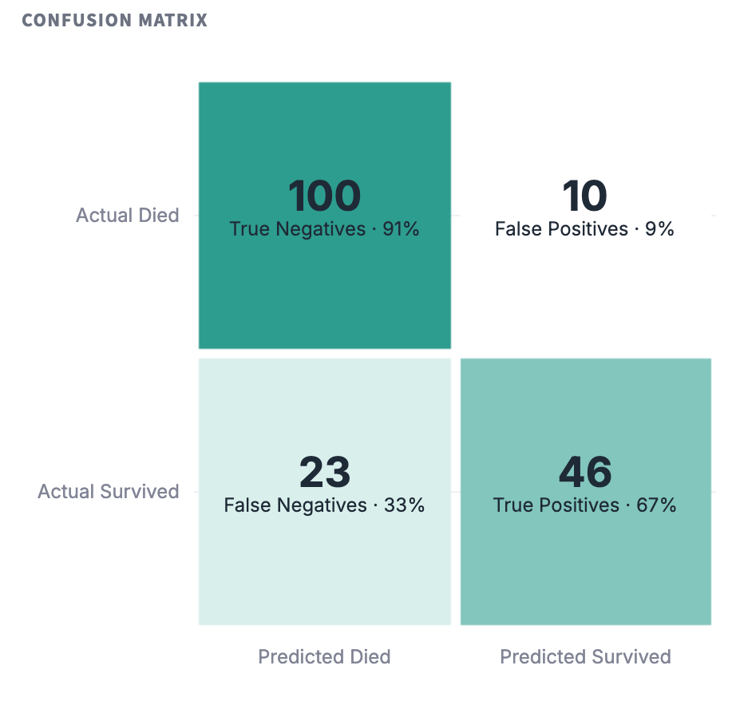
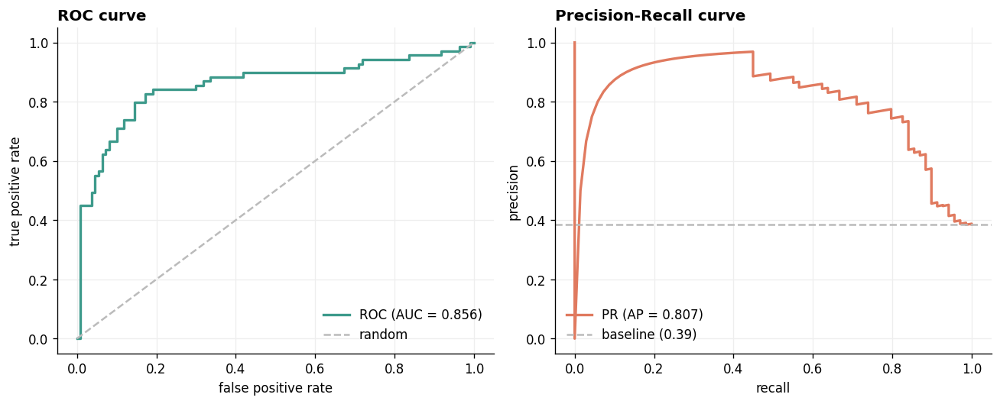
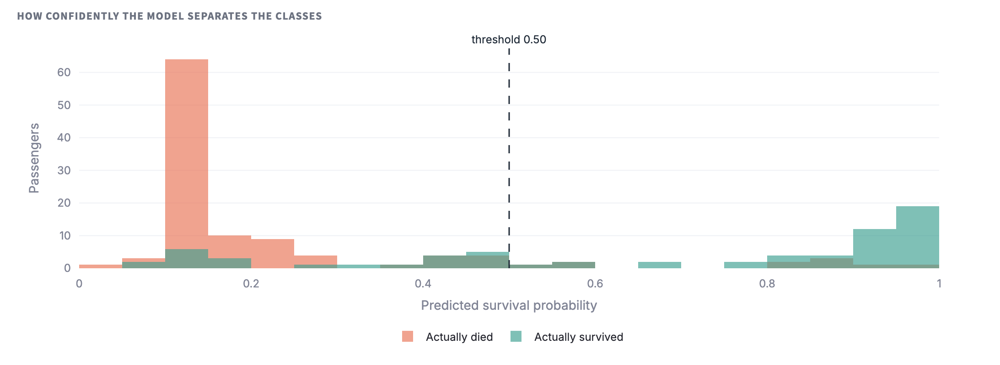
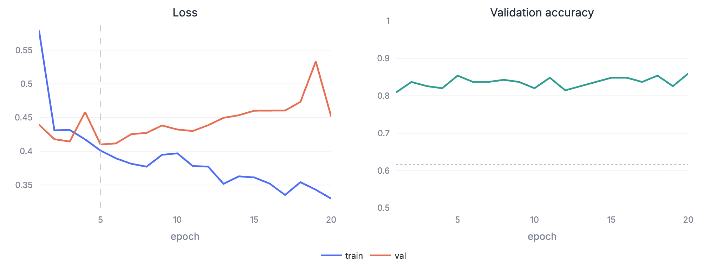
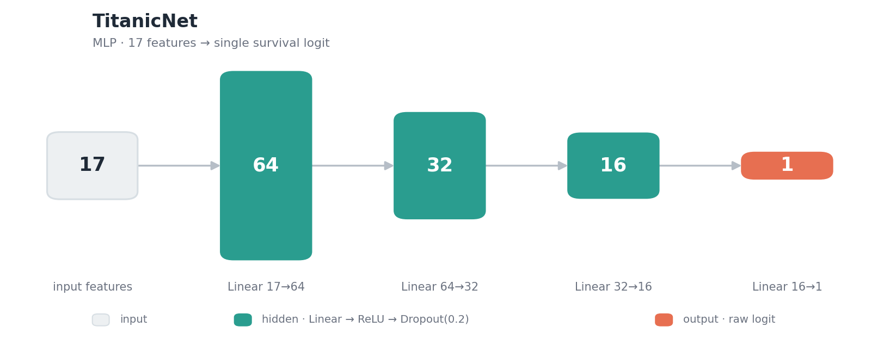

# Titanic Survival Prediction — End-to-End ML Pipeline

An end-to-end binary classification pipeline that predicts Titanic passenger survival with a
PyTorch neural network, from raw data all the way to an interactive evaluation & inference
dashboard.

The project covers the full lifecycle: **data fetching → exploratory analysis → leak-free
preprocessing → model training → evaluation → a Streamlit app**.

## Results

Performance on the held-out test set (20% of the labelled data, stratified split, seed 42):

| Metric | Score |
| --- | --- |
| Accuracy | 0.816 |
| Precision | 0.821 |
| Recall | 0.667 |
| F1 | 0.736 |
| ROC-AUC | 0.856 |

For reference, the majority-class baseline (predicting everyone dies) scores **≈ 0.62** accuracy,
so the model adds real signal. Accuracy is reported alongside F1 and ROC-AUC because the classes
are imbalanced (~38% survived) and accuracy alone can be misleading.

## Project structure

```
.
├── data_exploration.ipynb   # Part 1 — exploratory data analysis
├── preprocessing.py         # leak-free preprocessing (feature engineering + transforms)
├── train.py                 # Part 2 — standalone training script (model + training loop)
├── plots.py                 # metrics + matplotlib figures (used by train.py & evaluate.py)
├── evaluate.py              # load model from disk and evaluate (importable + CLI)
├── viz_plotly.py            # interactive Plotly charts for the dashboard
├── ds_app.py                # Streamlit dashboard (evaluation + inference)
├── requirements.txt
├── data/                    # small sample dataset
├── artifacts/               # created by train.py (weights, preprocessor, config, ...)
└── screenshots/             # example output figures
```

## Setup

Requires **Python 3.10+**.

## Installation

1. Clone the repository:
```bash
git clone https://github.com/ilyayaver95/home_assignment_ilya_yaverbaum_titanic_dataset.git
cd home_assignment_ilya_yaverbaum_titanic_dataset
```

2. (Optional but recommended) Create and activate a virtual environment:
```bash
python -m venv venv
source venv/bin/activate  # On Windows use: venv\Scripts\activate
```

3. Install the required dependencies:
```bash
pip install -r requirements.txt
```

### Data access (Kaggle)

The pipeline fetches the dataset directly from the Kaggle **Titanic** competition via `kagglehub`.
To run training you need Kaggle API credentials **and** to have accepted the competition rules:

1. Create a Kaggle account, go to **Settings → API → Create New Token** (downloads `kaggle.json`),
   or copy the `KGAT_...` token.
2. Make the token available in one of these ways:
   ```bash
   export KAGGLE_API_TOKEN=KGAT_xxxxxxxx           # single-token format
   # or place kaggle.json at ~/.kaggle/kaggle.json
   ```
3. Accept the competition rules once at <https://www.kaggle.com/c/titanic/rules>
   (downloads return HTTP 403 without this).

Dataset: <https://www.kaggle.com/competitions/titanic/data>. A 50-row sample is included in
`data/titanic_sample.csv` for quick inspection and for testing the inference tab without Kaggle.

> **Note on the data.** Kaggle ships `train.csv` (891 labelled rows) and `test.csv` (418 rows
> **without** the `Survived` column — the competition holdout). Because evaluation needs labels,
> the pipeline treats the labelled `train.csv` as the full dataset and creates its own stratified
> train/validation/test split.

## Running the project

### 1. Train the model

```bash
python train.py
```

This loads the data, preprocesses it, trains the network with early stopping, prints the test
metrics, and writes everything to `artifacts/`:

| File | Contents |
| --- | --- |
| `titanic_model.pth` | best model weights (lowest validation loss) |
| `prep_dict.pkl` | fitted preprocessor (medians, scaler, column layout) |
| `config.json` | architecture + hyperparameters (used to rebuild the model) |
| `history.csv` | per-epoch train/val loss and accuracy |
| `X_test.npy`, `y_test.npy` | the held-out test set |
| `test.csv` | raw held-out passengers (for the inference tab) |
| `training_curves.png`, `evaluation.png` | training / evaluation figures |

### 2. Launch the dashboard

```bash
streamlit run ds_app.py
```

Two tabs:
- **Held-out evaluation** — metrics and interactive plots on the test set saved by `train.py`.
- **Batch inference** — provide a CSV path (or upload one), the trained model is loaded from
  disk, inference runs, and results are shown. If the CSV contains a `Survived` column you also
  get full evaluation metrics and plots; otherwise you get predictions with a download button.

### 3. (Optional) Command-line evaluation

```bash
python evaluate.py                       # evaluate the held-out test set
python evaluate.py --csv data/titanic_sample.csv   # evaluate any CSV
```

### 4. (Optional) Explore the analysis

```bash
jupyter notebook data_exploration.ipynb
```

## Example usage

Held-out evaluation — confusion matrix, ROC / Precision-Recall curves:




Predicted-probability separation (how confidently the model tells the two classes apart — the
overlap around the threshold is where the errors live):



Training history (early stopping picks the lowest-validation-loss epoch):



## Architecture & design choices

**Data fetching (`preprocessing.py` / `train.py`).** Data is pulled from Kaggle in code via
`kagglehub`. A 50-row sample is committed so the repo is self-describing and the inference tab is
demonstrable without credentials.

**Preprocessing — leak-free by construction (`preprocessing.py`).** The single most important
decision. Transformations are split into two kinds:

- *Stateless, per-row feature engineering* (Title from `Name`, `FamilyBin` from `SibSp`+`Parch`,
  `HasCabin` from `Cabin`) is computed on the full frame — safe, because each passenger's features
  depend only on their own row.
- *Stateful transformations* (imputation medians, the scaler, one-hot categories) are learned on
  the training split only and then applied to validation/test. The learned state is bundled in
  `prep_dict.pkl` so inference reproduces training exactly.

Concrete choices, each justified in the EDA notebook:

- **Age** is imputed by Title-group median (Master ≈ 3.5 vs Mr ≈ 30), which preserves the child
  signal a global median would erase.
- **Fare** is `log1p`-transformed (raw skew ≈ 4.8 → ≈ 0.4) so extreme fares don't dominate.
- **Family size** is binned (Alone / Small / Large) because survival is non-monotonic in family
  size — it peaks around size 4 and collapses for large families.
- `Pclass` is kept as an ordinal numeric feature (its survival gradient is monotonic); `Sex`,
  `Embarked`, `TitleGrp`, `FamilyBin` are one-hot encoded; `Cabin` is dropped in favour of a
  `HasCabin` flag (77% missing, but "has a cabin record" is a strong class proxy).
- The split is stratified on the target to preserve the class ratio, and `OneHotEncoder`/the
  imputer handle unseen categories gracefully so inference never crashes on new data.

### Model architecture

`TitanicNet` (`train.py`) is a small configurable MLP that funnels the 17 input features down to a
single survival logit. Box height below is proportional to the number of units per layer:



Each hidden layer is a `Linear → ReLU → Dropout(0.2)` block. The **ReLU** non-linearity lets the
network model feature interactions (e.g. class mattering more for men than women, seen in the EDA),
and **Dropout** regularises training — it is automatically disabled at inference via `model.eval()`.
The final layer is a plain `Linear(16 → 1)` with **no activation**: it outputs a raw logit, because
`BCEWithLogitsLoss` applies the sigmoid internally for numerical stability (the sigmoid is applied
explicitly only at inference to turn the logit into a probability).

The funnel shape (64 → 32 → 16) progressively compresses the input into a more abstract
representation while keeping the model small — roughly **3.7k parameters**, appropriate for a
dataset of only ~530 training rows. Because `hidden_dims` is a constructor argument, the whole
shape is configurable without touching any other code.

**Training.** `BCEWithLogitsLoss` + Adam, with early stopping on validation loss. The best
checkpoint is snapshotted with `copy.deepcopy` (a plain `state_dict()` reference would drift to the
final epoch's weights). All hyperparameters and the input dimension are saved to `config.json`, so
the model can be rebuilt from disk anywhere.

**Evaluation (`evaluate.py`, `plots.py`, `viz_plotly.py`).** Reports accuracy, precision, recall,
F1 and ROC-AUC, with a confusion matrix, ROC and Precision-Recall curves, training history, and a
predicted-probability distribution. `evaluate.py` loads the model and preprocessor from disk and
works both as a CLI and as the backend for the app.

**Dashboard (`ds_app.py`).** A themed Streamlit app with interactive Plotly charts. It loads the
trained model from disk (rebuilt from `config.json`) and provides both the held-out evaluation view
and a CSV inference interface. Charts are decoupled from the evaluation logic so the same functions
serve the CLI and the UI.

**Reproducibility.** All randomness is seeded (`random`, `numpy`, `torch`), the split is
deterministic, and the fitted preprocessor + config are persisted, so `train.py` produces the same
artifacts and the app reflects them exactly.

### Honest limitations

- Training requires Kaggle credentials (no offline fallback in `train.py`).
- The decision threshold is fixed at 0.5 (the training default); found as optimal.
